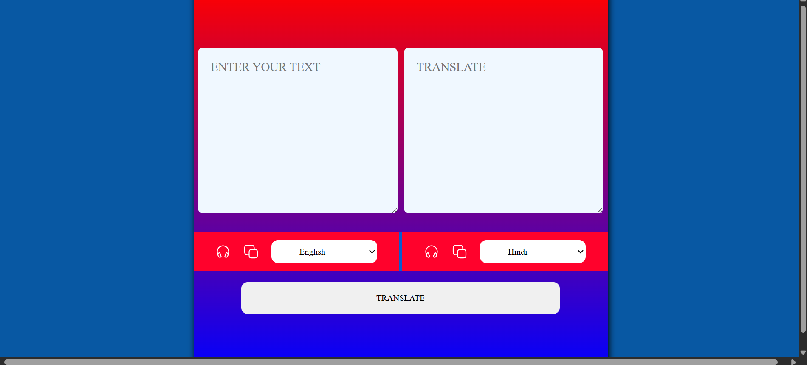

# Multi-Language Translator Web App

## Overview

A simple web-based language translator that allows users to translate text between multiple languages using JavaScript and a translation API. The application provides an easy-to-use interface for translating text, copying translated content, and listening to translations using text-to-speech functionality.

## Features

- Translate text between multiple languages
- User-friendly and responsive interface
- Copy translated text with a single click
- Text-to-speech support
- Multiple language selection
- Fast and simple translation process

## Technologies Used

- HTML5
- CSS3
- JavaScript

## Live Demo

🌐 **Live Website:**  
https://nithyapriyabn.github.io/multi-language-translator-webapp/

## Project Structure

```text
index.html
style.css
script.js
countries.js
copy.svg
speaker.svg
README.md
translator.png
```

## How to Run

1. Download or clone the repository.
2. Open `index.html` in any web browser.
3. Enter the text you want to translate.
4. Select the source and target languages.
5. Click the **Translate** button.
6. Copy or listen to the translated text.

## Screenshot



## Future Improvements

- Dark mode support
- Auto language detection
- Translation history
- Improved mobile responsiveness
- Speech-to-text input
- Language swap button

## Author

**Nithyapriya B N**

---

⭐ If you found this project useful, feel free to star the repository.
